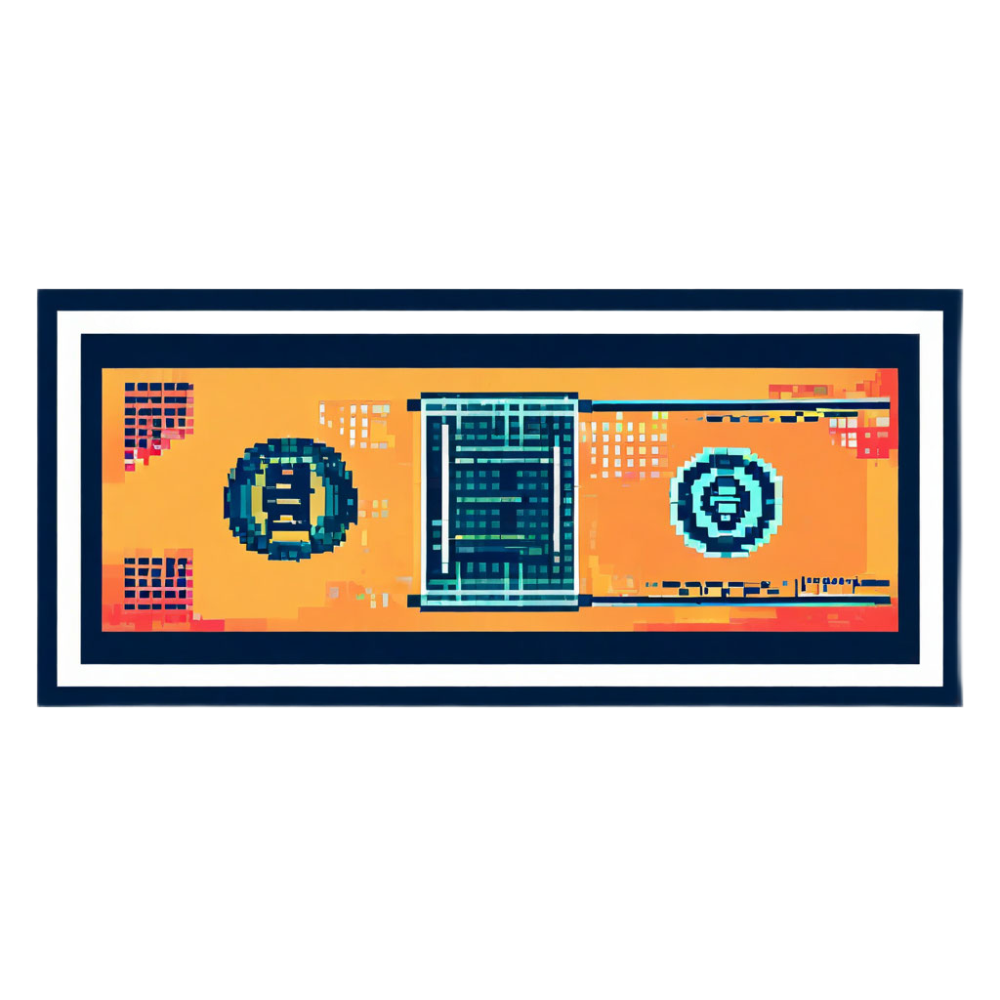
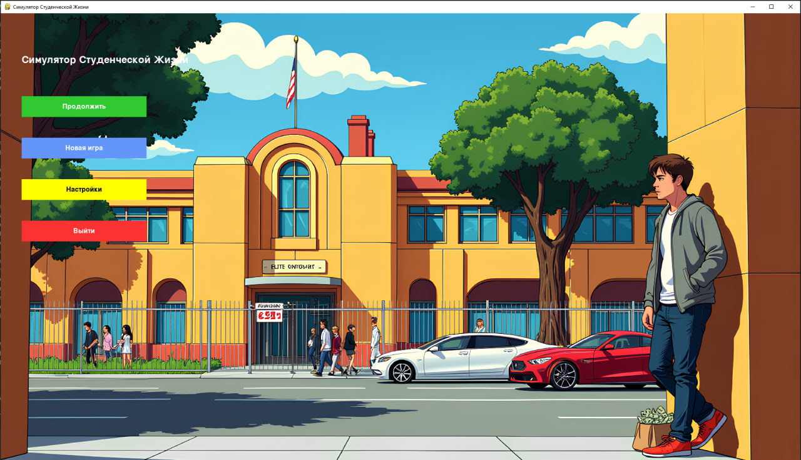
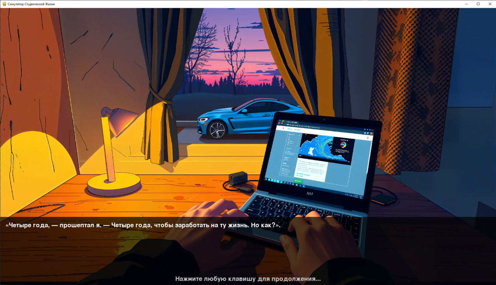
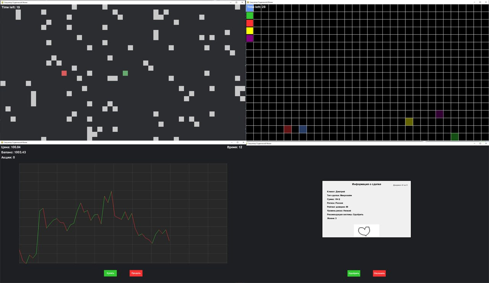
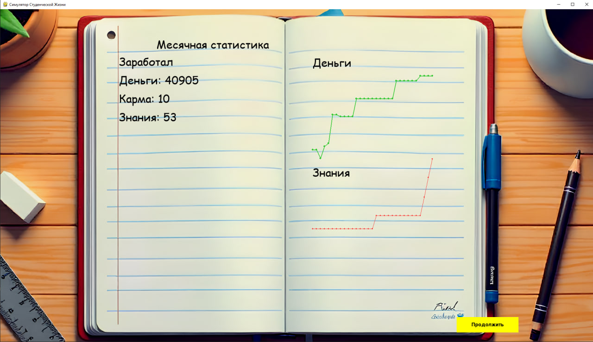

# 🎓 Симулятор Студенческой Жизни

<div align="center">
  
  
  [](https://www.python.org/downloads/)
  [](https://www.pygame.org/)
  []()

  *Погрузитесь в виртуальную студенческую жизнь и принимайте решения, которые повлияют на ваше будущее!*
</div>

---

## 📋 Содержание
- [Описание](#-описание)
- [Особенности](#-особенности)
- [Скриншоты](#-скриншоты)
- [Технические требования](#-технические-требования)
- [Установка](#-установка)
- [Игровой процесс](#-игровой-процесс)
- [Команда разработчиков](#-команда-разработчиков)
- [Лицензия](#-лицензия)

---

## 📝 Описание
Симулятор Студенческой Жизни - это увлекательная игра-кликер, которая позволяет игроку прожить виртуальную студенческую жизнь. В игре вы сможете учиться, работать, участвовать в различных активностях и принимать решения, которые повлияют на вашу виртуальную жизнь.

---

## ✨ Особенности

### 🎮 Игровые механики
- **Система обучения**
  - 📚 Посещение лекций
  - 🔬 Лабораторные работы
  - 📝 Экзамены
  - 📊 Система прогресса обучения

- **Экономическая система**
  - 💰 Активный заработок
  - 💎 Пассивный доход
  - 📈 Инвестиции
  - 💳 Управление финансами

- **Мини-игры**
  - 🚚 Доставка
  - 💻 Фриланс-программирование
  - 📊 Торговля
  - 🤝 P2P-сервисы

### 🎯 Дополнительные функции
- 📈 Система статистики и графиков
- 🎬 Сюжетные события
- 🌟 Достижения
- 💾 Система сохранений
- ⚙️ Настраиваемые параметры

---

## 🖼️ Скриншоты

<div align="center">
  
  
  
  
</div>

---

## 🛠️ Технические требования
- Python 3.8 или выше
- Pygame 2.5.2
- Минимум 2GB оперативной памяти
- Разрешение экрана 1280x720 или выше

---

## 📥 Установка

1. **Клонируйте репозиторий:**
```bash
git clone https://github.com/your-username/Student_simulator_clicker.git
```

2. **Перейдите в директорию проекта:**
```bash
cd Student_simulator_clicker
```

3. **Создайте виртуальное окружение:**
```bash
python -m venv venv
```

4. **Активируйте виртуальное окружение:**
- Windows:
```bash
venv\Scripts\activate
```
- Linux/Mac:
```bash
source venv/bin/activate
```

5. **Установите зависимости:**
```bash
pip install -r requirements.txt
```

6. **Запустите игру:**
```bash
python Game.py
```

---

## 🎮 Игровой процесс

### Основные действия
- 📚 **Учеба** - посещайте лекции и лабораторные работы
- 💼 **Работа** - выбирайте различные способы заработка
- 🎯 **Мини-игры** - участвуйте в дополнительных активностях
- 📊 **Статистика** - отслеживайте свой прогресс

### Управление
- 🖱️ ЛКМ - взаимодействие с элементами интерфейса
- ⏭️ Пробел - пропуск диалогов и анимаций
- ⚙️ ESC - открытие меню настроек
- 🖥️ F11 - переключение полноэкранного режима

---

## 👥 Команда разработчиков

<div align="center">
  
| Роль                           | Имя |
|--------------------------------|-----|
| 🎮 Руководитель проекта        | Шмаков Григорий |
| 🎯 Разработчик мини-игр        | Карелин Илья |
| 💻 Разработчик игровых механик | Бибиков Никита |
| 🎨 Разработчик интерфейса      | Фесенко Виктор |

</div>


---

## 🙏 Благодарности
- Pygame за отличный игровой движок
- Всем тестировщикам и контрибьюторам
- Сообществу Python за поддержку

---

<div align="center">
  <sub>Последнее обновление: 05.05.2025</sub>
</div>
